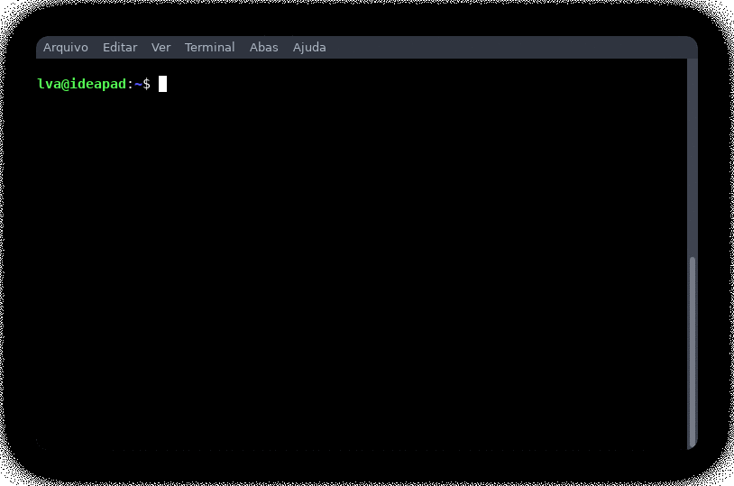

# IPerl
> Interactive Perl interpreter

This is a simple REPL (Read, Execute, Print, Loop) script that aims to provide an easy and fun way to run a interactive Perl interpreter.

## Dependencies

- Term::ReadLine::Gnu
> user@pc:~$ cpan Term::ReadLine::Gnu

## Installation

OS X & Linux:

```
git clone https://github.com/lvmalware/iperl && \
cd iperl && \
sudo ./install.sh
```

Windows:

Not implemented yet

## Usage example



## Latest updates

- Version 1.1
- Added an install.sh for easy installation within unix-like systems
- Moved execution context away from IPerl's code scope to avoid conflicts
- Added support for custom modules (need to be expanded ...)


## TODO list

- Add syntax highlight
- Add more custom modules
- Allow editing multi-line code
- Improve multi-line code support
- Add a way for the user to quickly deploy his own modules

## Meta

Lucas V. Araujo – lucas.vieira.ar@disroot.org

Distributed under the GNU GPL-3.0+ license. See ``LICENSE`` for more information.

[https://github.com/LvMalware/iperl](https://github.com/LvMalware/)

## Contributing

1. Fork it (<https://github.com/LvMalware/iperl/fork>)
2. Create your feature branch (`git checkout -b feature/fooBar`)
3. Commit your changes (`git commit -am 'Add some fooBar'`)
4. Push to the branch (`git push origin feature/fooBar`)
5. Create a new Pull Request
